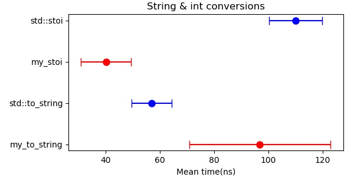

# my_func vs std::func

This repo holds code for investigating if a simple or novice implementation of a given function is "faster" than the standard library functions that are available. I placed faster in quotation marks since this is only an estimation and not an exact science, this is just for fun. Each function pair that I put in a 1 v 1 battle are displayed under *Cases* below.


All **my_func** methods are implemented with both simplicity and speed in mind, where simplicity is the more important category in my opinion. Because in a realistic senario I wouldn't spend to much time on optimizing a to_string method for example.

# Cases

## Converting std::string to int and back



# my_to_string v.s std::to_string

Example run:

```
[my_to_string] mean-time: 88.74 ns, std-dev: 14.4389 ns
[std::to_string] mean-time: 54.11 ns, std-dev: 6.41044 ns
```

std::string is faster for sure in this test. 


# my_stoi v.s std::stoi

Example run:

```
[my_stoi] mean-time: 38.85 ns, std-dev: 7.40463 ns
[std::stoi] mean-time: 106.28 ns, std-dev: 7.32189 ns
```

my_stoi was faster for sure in this test.


## Usage

Compiler:  gcc (MinGW-W64 x86_64-posix-seh, built by Brecht Sanders) 10.2.0

Build with CMake.
´´´
mkdir build && cd build
cmake ..
make
´´´